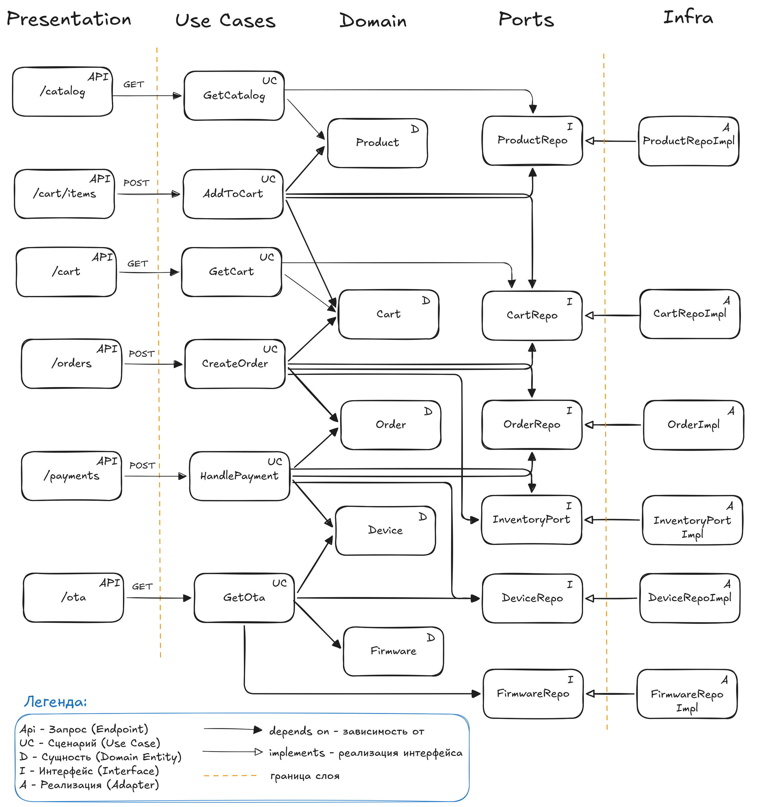

# AIS IoT Store

Учебный проект, демонстрирующий реализацию чистой архитектуры на примере интернет-магазина IoT устройств.

## Архитектура



## Структура

```text
app/
  adapters/      # In-Memory реализации портов
  domain/        # доменные сущности и ошибки
  ports/         # интерфейсы репозиториев и портов
  presentation/  # FastAPI endpoints, DI, схемы
  usecases/      # application layer
  main.py        # точка входа
```

## Быстрый запуск

```bash
python -m venv .venv
source .venv/bin/activate
pip install -e .
uvicorn app.main:app --reload
```

## Эндпоинты

- `GET /catalog`
- `POST /cart/items`
- `GET /cart`
- `POST /orders`
- `POST /payments`
- `GET /ota?device_id=...`

## Проверка эндпоинтов

1) Проверка health

```sh
curl -X GET "http://127.0.0.1:8000/health"
```

2) Получить каталог товаров

```sh
curl -X GET "http://127.0.0.1:8000/catalog"
```

3) Добавить товар в корзину

```sh
curl -X POST "http://127.0.0.1:8000/cart/items" \
  -H "Content-Type: application/json" \
  -d '{ "product_id": "sensor-001", "quantity": 1 }'
```

4) Получить корзину

```sh
curl -X GET "http://127.0.0.1:8000/cart"
```

5) Создать заказ

```sh
curl -X POST "http://127.0.0.1:8000/orders"
```

Сохранить id заказа.

6) Оплатить заказ

```sh
curl -X POST "http://127.0.0.1:8000/payments" \
  -H "Content-Type: application/json" \
  -d '{ "order_id" : "<id>" }'
```

7) Получить OTA обновление

```sh
curl -X GET "http://127.0.0.1:8000/ota?device_id=<device_id>"
```

## Выявленные несоответствия заявленной архитектуре

- В контракте нет публичного API для получения `device_id` после оплаты, хотя `/ota` требует его на вход.
- Use Case CreateOrder не использует зависимость от InventoryPort. Логика резервации товаров была упрощена в учебных целях, но зависимость намеренно внедряется.

## Запуск тестов

```sh
pytest
```

## OLTP PostgreSQL

### Состав

```text
db/00_schema.sql                    # DDL PostgreSQL
db/01_seed_data.sql                 # генерация тестовых данных
db/02_payment_transaction_explain.sql # EXPLAIN ANALYZE для POST /payments
db/03_payment_transaction_plain.sql # обычная SQL-транзакция оплаты
db/04_index_experiments.sql         # hash vs B-tree experiments
db/run_all.sql                      # запуск всех SQL-скриптов из psql

results/                            # сюда сохраняются результаты EXPLAIN
```

### Быстрый запуск через Docker

```bash
docker compose up -d

docker exec -i ais_iot_store_pg psql -U ais -d ais_iot_store -f /work/db/00_schema.sql
docker exec -i ais_iot_store_pg psql -U ais -d ais_iot_store -f /work/db/01_seed_data.sql

docker exec -i ais_iot_store_pg psql -U ais -d ais_iot_store -f /work/db/02_payment_transaction_explain.sql > results/payment_transaction_explain.txt

docker exec -i ais_iot_store_pg psql -U ais -d ais_iot_store -f /work/db/04_index_experiments.sql > results/index_experiments.txt
```

Удалить БД полностью:

```bash
docker compose down -v
```
