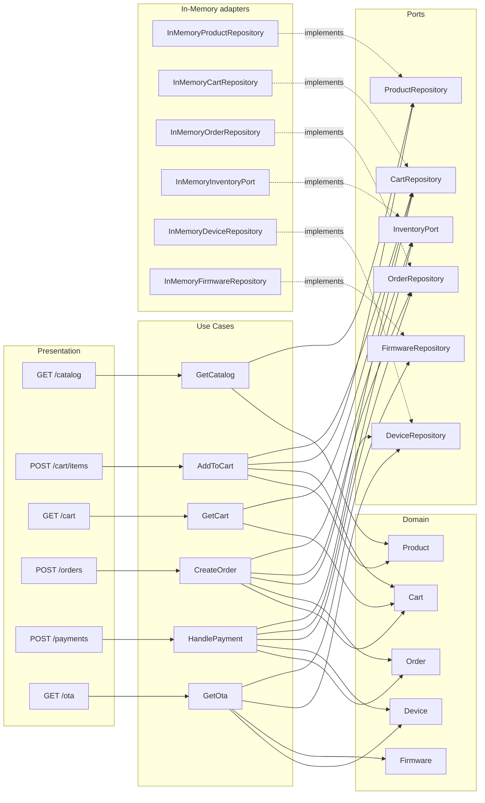

# Архитектурная схема

Ниже схема, повторяющая слои и зависимости из документа: Presentation → Use Cases → Domain → Ports → Infra.

```mermaid
flowchart LR
  subgraph Presentation
    P1[GET /catalog]
    P2[POST /cart/items]
    P3[GET /cart]
    P4[POST /orders]
    P5[POST /payments]
    P6[GET /ota]
  end

  subgraph UseCases[Use Cases]
    U1[GetCatalog]
    U2[AddToCart]
    U3[GetCart]
    U4[CreateOrder]
    U5[HandlePayment]
    U6[GetOta]
  end

  subgraph Domain
    D1[Product]
    D2[Cart]
    D3[Order]
    D4[Device]
    D5[Firmware]
  end

  subgraph Ports
    I1[ProductRepository]
    I2[CartRepository]
    I3[OrderRepository]
    I4[InventoryPort]
    I5[DeviceRepository]
    I6[FirmwareRepository]
  end

  subgraph Infra[In-Memory adapters]
    A1[InMemoryProductRepository]
    A2[InMemoryCartRepository]
    A3[InMemoryOrderRepository]
    A4[InMemoryInventoryPort]
    A5[InMemoryDeviceRepository]
    A6[InMemoryFirmwareRepository]
  end

  P1 --> U1
  P2 --> U2
  P3 --> U3
  P4 --> U4
  P5 --> U5
  P6 --> U6

  U1 --> D1
  U1 --> I1

  U2 --> D1
  U2 --> D2
  U2 --> I1
  U2 --> I2

  U3 --> D2
  U3 --> I2

  U4 --> D2
  U4 --> D3
  U4 --> I2
  U4 --> I3
  U4 --> I4

  U5 --> D3
  U5 --> D4
  U5 --> I3
  U5 --> I4
  U5 --> I5

  U6 --> D4
  U6 --> D5
  U6 --> I5
  U6 --> I6

  A1 -. implements .-> I1
  A2 -. implements .-> I2
  A3 -. implements .-> I3
  A4 -. implements .-> I4
  A5 -. implements .-> I5
  A6 -. implements .-> I6
```
